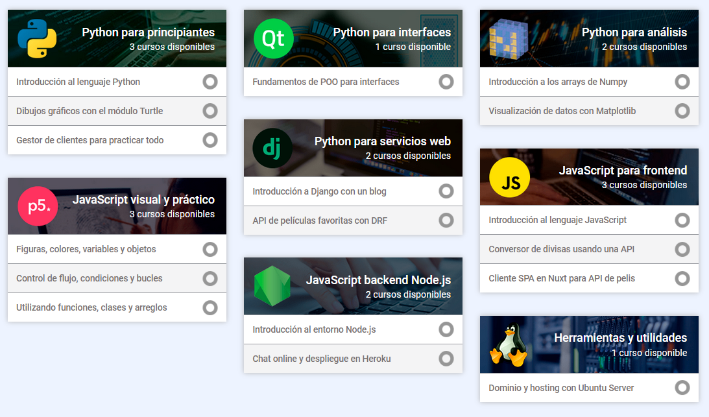

<h1 align="left">Hola 👋, me llamo Hektor!</h1>
<h3 align="left">Soy un apasionado programador e instructor de España.</h3>

- 🎓 Soy el creador del [Curso Maestro de Python 3](https://www.hektorprofe.net/cupon/python) en Udemy con más de 65.000 estudiantes.

- 🌱 Me interesa mucho el estudio de la programación para su aplicación gráfica y en los videojuegos.

- 📝 En mi [archivo](https://docs.hektorprofe.net/) tengo cientos de apuntes, tutoriales y cursos sobre Python, Django, JS, Unity, etc.

<!-- - 👨‍💻 Mis proyectos personales se pueden encontrar en mi [portafolio](https://hektor.dev/portafolio).

- 📝 Desde hace poco estoy publicando lo que se me ocurre en mi [blog](https://hektor.dev/). -->

<h3 align="left">Lenguajes</h3> 

    
    
    
    
    
    
    
    
    
    

<h3 align="left">Habilidades</h3> 

    
    
    
    
    
    
    
    
    
    
    
    
    
    
    
    
    
    
    
    
    
    
    
    
    

<!--
<h3 align="left">Akademia Hektor Profe</h3>

Quizá alguno de mis cursos gratuitos te puede servir:

<h3 align="left">Social</h3>

<h3 align="left">Stats</h3>
&nbsp;

-->
